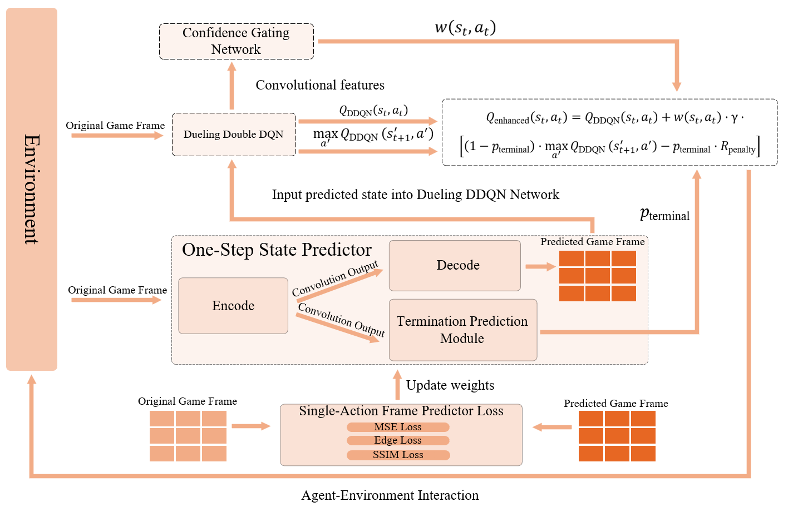

# PD3QN: A Predictive Dueling Double Deep Q-Network with Lightweight Future State Prediction and Adaptive Confidence Gating

[](https://opensource.org/licenses/MIT)
[](https://www.python.org/downloads/)
[](https://pytorch.org/)

我们提出了 **PD3QN**，一种新颖的预测型D3QN，旨在解决高动态、低容错环境（如带火球的 Flappy Bird）中的决策短视 (Decision Myopia)问题。

针对传统 Model-free 算法缺乏前瞻性的痛点，我们率先引入了轻量级一步状态预测器 (OSSP)来推断未来画面及潜在风险，并配合自适应置信度门控网络 (CGN)动态调节预测结果在决策中的权重。通过这种机制，PD3QN 能够在保证训练稳定性的同时，显著增强智能体的长程规划能力与鲁棒性。
<p align="center">
  
  <br>
  <em>图：PD3QN 整体架构图</em>
</p>


接下来，我们将一步一步指导您如何使用这个代码库。 👇

## 📂 目录结构

基于本仓库的代码组织：

```text
PD3QN/
├── assets/                          # 游戏资源 (图片 sprites, 字体 fonts)
├── DDQN_Innovation_Research/
│   └── improvements/
│       └── experiments/
│           └── train_PD3QN.py       # 🚀 核心训练脚本
├── logs/                            # TensorBoard 日志文件
├── results/                         # 模型保存 (.pth) 和测试报告 (.json)
├── src/                             # 源代码库
│   ├── flappy_bird.py               # 游戏环境 (训练版)
│   ├── flappy_bird-test.py          # 游戏环境 (测试版 - 无头模式适配)
├── requirements.txt             # 项目依赖列表
├── test_PD3QN.py                    # 🧪 批量测试脚本
└── README.md                        # 项目说明文档
```

## ⚙️ 环境安装

1. **克隆仓库:**

   ```bash
   git clone https://github.com/pan6651/PD3QN.git
   cd PD3QN
   ```

2. **创建虚拟环境 (推荐):**

   ```bash
   conda create -n pd3qn python=3.10
   conda activate pd3qn
   ```

3. **安装依赖:**
   注意：`requirements.txt` 位于 `src` 目录下。

   ```bash
   pip install -r src/requirements.txt
   ```
   *主要依赖包括: `torch`, `pygame`, `opencv-python`, `tensorboardX`, `numpy` 等。*

## 🚀 使用指南

### 训练模型
从头开始训练 PD3QN 模型。脚本使用 `StratifiedExperienceBuffer` 和 `FixedActionVectors`。

由于脚本路径较深，请在项目根目录下运行：

```bash
python DDQN_Innovation_Research/improvements/experiments/train_PD3QN.py
```

* **配置:** 您可以在 `train_PD3QN.py` 中直接修改超参数（Batch size, LR, Gamma 等）。
* **日志:** 训练日志将保存至 `logs/PD3QN_FixedVectors/`。
* **模型:** 检查点（Checkpoints）将保存至 `results/PD3QN_FixedVectors/`。

### 测试模型
用于评估已训练的模型。该脚本会执行批量测试，计算修剪后的平均分（去除最高/最低分），并生成详细报告。

```bash
python test_PD3QN.py
```

* 脚本会自动搜索 `results/PD3QN_FixedVectors/` 目录下的模型文件。
* 测试摘要和详细 JSON 报告将生成在 `results/test_reports/` 中。

### 监控训练
使用 TensorBoard 实时查看 Loss 和 Q值曲线：

```bash
tensorboard --logdir=logs/PD3QN_FixedVectors
```

## 🎮 环境说明: Flappy Bird with Fireballs

本环境是基于 `pygame` 修改的高难度版本：

* **状态 (State):** 连续 4 帧堆叠的灰度图像 (84x84)。
* **动作 (Actions):** 0 (什么都不做), 1 (跳跃/Flap)。
* **奖励 (Rewards):**
    * 存活每帧: +0.1
    * 通过管道: +1.0
    * 躲避火球: +0.5
    * 碰撞 (Terminal): -1.0
    * *密集引导:* 基于与管道中心距离的连续奖励/惩罚。


## 🤝 致谢 (Acknowledgments)

* **代码致谢 (Code Reference):**
    本项目的游戏环境代码参考并修改自 [SeVEnMY/ReinforcementLearningFlappyBird](https://github.com/SeVEnMY/ReinforcementLearningFlappyBird)。
   

* **基金支持 (Funding):**
    本研究工作得到了以下项目的资助：
    * **National Natural Science Foundation of China** (Grant No. 62471272, 61806107, 62201314)
    * **Opening Project of State Key Laboratory of Digital Publishing Technology**
    * **NSF of Shandong Province** (Grant No. ZR2025MS986)


